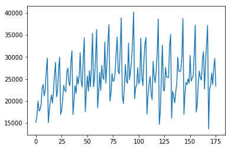
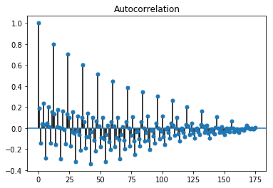
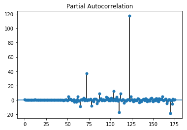
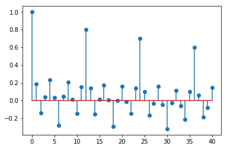
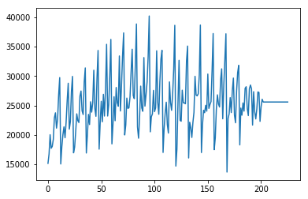
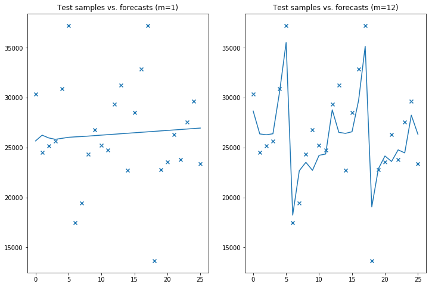
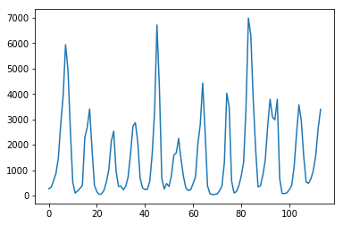
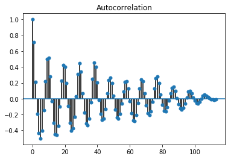
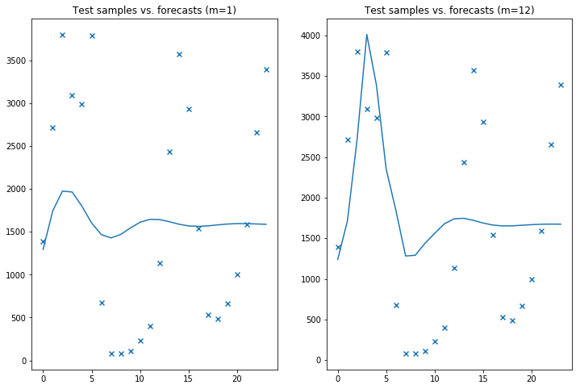

https://www.alkaline-ml.com/pmdarima/tips_and_tricks.html


```python
import pmdarima as pm
import numpy as np
from pmdarima.datasets import load_wineind
import matplotlib.pyplot as plt
from statsmodels.tsa.stattools import acf, pacf
import statsmodels.tsa.stattools as ts
from statsmodels.tsa.arima_model import ARIMA
```


```python
wineind = load_wineind().astype(np.float64)
plt.plot(wineind)
```


    [<matplotlib.lines.Line2D at 0x11e0efe10>]





```python
pm.plot_acf(wineind)
pm.plot_pacf(wineind)
```





    /usr/local/lib/python3.6/site-packages/statsmodels/regression/linear_model.py:1283: RuntimeWarning: invalid value encountered in sqrt
      return rho, np.sqrt(sigmasq)





```python
from pmdarima.arima.utils import nsdiffs

D = nsdiffs(wineind,
            m=10,  # commonly requires knowledge of dataset
            max_D=12,
            test='ch') 
```


```python
plt.stem(acf(wineind))
```


    <StemContainer object of 3 artists>





```python
fit = pm.auto_arima(wineind, 
                    start_p=2, start_q=2,
                    max_p=5,   max_q=5,   m=12,
                    start_P=1, seasonal=True,
                    d=None, D=None, trace=True,
                    error_action='ignore',  
                    suppress_warnings=True, 
                    stepwise=True)
```

    Fit ARIMA: order=(2, 0, 2) seasonal_order=(1, 0, 1, 12); AIC=nan, BIC=nan, Fit time=nan seconds
    Fit ARIMA: order=(0, 0, 0) seasonal_order=(0, 0, 0, 12); AIC=3523.727, BIC=3530.068, Fit time=0.014 seconds
    Fit ARIMA: order=(1, 0, 0) seasonal_order=(1, 0, 0, 12); AIC=nan, BIC=nan, Fit time=nan seconds
    Fit ARIMA: order=(0, 0, 1) seasonal_order=(0, 0, 1, 12); AIC=3411.801, BIC=3424.483, Fit time=0.162 seconds
    Fit ARIMA: order=(0, 0, 1) seasonal_order=(1, 0, 1, 12); AIC=nan, BIC=nan, Fit time=nan seconds
    Fit ARIMA: order=(0, 0, 1) seasonal_order=(0, 0, 0, 12); AIC=3516.469, BIC=3525.980, Fit time=0.012 seconds
    Fit ARIMA: order=(0, 0, 1) seasonal_order=(0, 0, 2, 12); AIC=3364.298, BIC=3380.151, Fit time=0.562 seconds
    Fit ARIMA: order=(1, 0, 1) seasonal_order=(0, 0, 2, 12); AIC=3421.497, BIC=3440.520, Fit time=0.311 seconds
    Fit ARIMA: order=(0, 0, 0) seasonal_order=(0, 0, 2, 12); AIC=3368.625, BIC=3381.307, Fit time=0.525 seconds
    Fit ARIMA: order=(0, 0, 2) seasonal_order=(0, 0, 2, 12); AIC=3362.398, BIC=3381.421, Fit time=0.983 seconds
    Fit ARIMA: order=(1, 0, 3) seasonal_order=(0, 0, 2, 12); AIC=3425.722, BIC=3451.085, Fit time=0.523 seconds
    Fit ARIMA: order=(0, 0, 2) seasonal_order=(1, 0, 2, 12); AIC=3424.600, BIC=3446.793, Fit time=1.600 seconds
    Fit ARIMA: order=(0, 0, 2) seasonal_order=(0, 0, 1, 12); AIC=3442.559, BIC=3458.412, Fit time=0.117 seconds
    Fit ARIMA: order=(1, 0, 2) seasonal_order=(0, 0, 2, 12); AIC=3363.825, BIC=3386.018, Fit time=1.174 seconds
    Fit ARIMA: order=(0, 0, 3) seasonal_order=(0, 0, 2, 12); AIC=3364.552, BIC=3386.745, Fit time=0.837 seconds
    Total fit time: 6.832 seconds


```python
fit.summary()
```


<table class="simpletable">
<caption>Statespace Model Results</caption>
<tr>
  <th>Dep. Variable:</th>                  <td>y</td>               <th>  No. Observations:  </th>    <td>176</td>   
</tr>
<tr>
  <th>Model:</th>           <td>SARIMAX(0, 0, 2)x(0, 0, 2, 12)</td> <th>  Log Likelihood     </th> <td>-1675.199</td>
</tr>
<tr>
  <th>Date:</th>                   <td>Wed, 28 Nov 2018</td>        <th>  AIC                </th> <td>3362.398</td> 
</tr>
<tr>
  <th>Time:</th>                       <td>22:29:03</td>            <th>  BIC                </th> <td>3381.421</td> 
</tr>
<tr>
  <th>Sample:</th>                         <td>0</td>               <th>  HQIC               </th> <td>3370.114</td> 
</tr>
<tr>
  <th></th>                             <td> - 176</td>             <th>                     </th>     <td> </td>    
</tr>
<tr>
  <th>Covariance Type:</th>               <td>opg</td>              <th>                     </th>     <td> </td>    
</tr>
</table>
<table class="simpletable">
<tr>
      <td></td>         <th>coef</th>     <th>std err</th>      <th>z</th>      <th>P>|z|</th>  <th>[0.025</th>    <th>0.975]</th>  
</tr>
<tr>
  <th>intercept</th> <td> 2.558e+04</td> <td>  532.340</td> <td>   48.052</td> <td> 0.000</td> <td> 2.45e+04</td> <td> 2.66e+04</td>
</tr>
<tr>
  <th>ma.L1</th>     <td>    0.1921</td> <td>    0.064</td> <td>    2.983</td> <td> 0.003</td> <td>    0.066</td> <td>    0.318</td>
</tr>
<tr>
  <th>ma.L2</th>     <td>   -0.1462</td> <td>    0.083</td> <td>   -1.764</td> <td> 0.078</td> <td>   -0.309</td> <td>    0.016</td>
</tr>
<tr>
  <th>ma.S.L12</th>  <td>    0.7462</td> <td>    0.064</td> <td>   11.572</td> <td> 0.000</td> <td>    0.620</td> <td>    0.873</td>
</tr>
<tr>
  <th>ma.S.L24</th>  <td>    0.5695</td> <td>    0.070</td> <td>    8.156</td> <td> 0.000</td> <td>    0.433</td> <td>    0.706</td>
</tr>
<tr>
  <th>sigma2</th>    <td> 1.008e+07</td> <td> 1.12e+06</td> <td>    8.967</td> <td> 0.000</td> <td> 7.88e+06</td> <td> 1.23e+07</td>
</tr>
</table>
<table class="simpletable">
<tr>
  <th>Ljung-Box (Q):</th>          <td>111.21</td> <th>  Jarque-Bera (JB):  </th> <td>0.08</td>
</tr>
<tr>
  <th>Prob(Q):</th>                 <td>0.00</td>  <th>  Prob(JB):          </th> <td>0.96</td>
</tr>
<tr>
  <th>Heteroskedasticity (H):</th>  <td>1.78</td>  <th>  Skew:              </th> <td>0.03</td>
</tr>
<tr>
  <th>Prob(H) (two-sided):</th>     <td>0.03</td>  <th>  Kurtosis:          </th> <td>3.09</td>
</tr>
</table><br/><br/>Warnings:<br/>[1] Covariance matrix calculated using the outer product of gradients (complex-step).


```python
pred = fit.predict(n_periods=50)
plt.plot(np.concatenate((wineind,pred)))
```


    [<matplotlib.lines.Line2D at 0x12ae6d4e0>]





```python
train, test = wineind[:150], wineind[150:]

# Fit two different ARIMAs
m1 = pm.auto_arima(train, error_action='ignore', seasonal=True, m=1)
m12 = pm.auto_arima(train, error_action='ignore', seasonal=True, m=12)
```

    /usr/local/lib/python3.6/site-packages/statsmodels/tsa/statespace/representation.py:375: FutureWarning: Using a non-tuple sequence for multidimensional indexing is deprecated; use `arr[tuple(seq)]` instead of `arr[seq]`. In the future this will be interpreted as an array index, `arr[np.array(seq)]`, which will result either in an error or a different result.
      return matrix[[slice(None)]*(matrix.ndim-1) + [0]]
    /usr/local/lib/python3.6/site-packages/statsmodels/base/model.py:508: ConvergenceWarning: Maximum Likelihood optimization failed to converge. Check mle_retvals
      "Check mle_retvals", ConvergenceWarning)
    /usr/local/lib/python3.6/site-packages/statsmodels/base/model.py:508: ConvergenceWarning: Maximum Likelihood optimization failed to converge. Check mle_retvals
      "Check mle_retvals", ConvergenceWarning)
    /usr/local/lib/python3.6/site-packages/statsmodels/base/model.py:508: ConvergenceWarning: Maximum Likelihood optimization failed to converge. Check mle_retvals
      "Check mle_retvals", ConvergenceWarning)
    /usr/local/lib/python3.6/site-packages/statsmodels/base/model.py:508: ConvergenceWarning: Maximum Likelihood optimization failed to converge. Check mle_retvals
      "Check mle_retvals", ConvergenceWarning)
    /usr/local/lib/python3.6/site-packages/statsmodels/base/model.py:508: ConvergenceWarning: Maximum Likelihood optimization failed to converge. Check mle_retvals
      "Check mle_retvals", ConvergenceWarning)
    /usr/local/lib/python3.6/site-packages/statsmodels/base/model.py:508: ConvergenceWarning: Maximum Likelihood optimization failed to converge. Check mle_retvals
      "Check mle_retvals", ConvergenceWarning)
    /usr/local/lib/python3.6/site-packages/statsmodels/base/model.py:508: ConvergenceWarning: Maximum Likelihood optimization failed to converge. Check mle_retvals
      "Check mle_retvals", ConvergenceWarning)
    /usr/local/lib/python3.6/site-packages/statsmodels/base/model.py:508: ConvergenceWarning: Maximum Likelihood optimization failed to converge. Check mle_retvals
      "Check mle_retvals", ConvergenceWarning)
    /usr/local/lib/python3.6/site-packages/statsmodels/base/model.py:508: ConvergenceWarning: Maximum Likelihood optimization failed to converge. Check mle_retvals
      "Check mle_retvals", ConvergenceWarning)
    /usr/local/lib/python3.6/site-packages/statsmodels/base/model.py:508: ConvergenceWarning: Maximum Likelihood optimization failed to converge. Check mle_retvals
      "Check mle_retvals", ConvergenceWarning)
    /usr/local/lib/python3.6/site-packages/statsmodels/base/model.py:508: ConvergenceWarning: Maximum Likelihood optimization failed to converge. Check mle_retvals
      "Check mle_retvals", ConvergenceWarning)


```python
fig, axes = plt.subplots(1, 2, figsize=(12, 8))
x = np.arange(test.shape[0])

# Plot m=1
axes[0].scatter(x, test, marker='x')
axes[0].plot(x, m1.predict(n_periods=test.shape[0]))
axes[0].set_title('Test samples vs. forecasts (m=1)')

# Plot m=12
axes[1].scatter(x, test, marker='x')
axes[1].plot(x, m12.predict(n_periods=test.shape[0]))
axes[1].set_title('Test samples vs. forecasts (m=12)')

plt.show()
```





## Lynx Dataset
https://www.alkaline-ml.com/pmdarima/modules/datasets.html


```python
from pmdarima.datasets import load_lynx
```


```python
hr = load_lynx()
```


```python
plt.plot(hr)
```


    [<matplotlib.lines.Line2D at 0x1319045f8>]





```python
pm.plot_acf(hr)
```





```python

fit = pm.auto_arima(hr, 
                    start_p=1, start_q=1,
                    max_p=10,   max_q=10,  max_D=10,  m=10, M=10, max_P=10, max_Q=10,
                    start_P=1, seasonal=True,
                    d=None, D=None, trace=True,
                    error_action='ignore',  
                    suppress_warnings=True, 
                    stepwise=True)
```

    Fit ARIMA: order=(1, 0, 1) seasonal_order=(1, 0, 1, 10); AIC=1876.815, BIC=1893.232, Fit time=0.164 seconds
    Fit ARIMA: order=(0, 0, 0) seasonal_order=(0, 0, 0, 10); AIC=2006.616, BIC=2012.089, Fit time=0.006 seconds
    Fit ARIMA: order=(1, 0, 0) seasonal_order=(1, 0, 0, 10); AIC=1900.447, BIC=1911.392, Fit time=0.297 seconds
    Fit ARIMA: order=(0, 0, 1) seasonal_order=(0, 0, 1, 10); AIC=1901.513, BIC=1912.458, Fit time=0.093 seconds
    Fit ARIMA: order=(1, 0, 1) seasonal_order=(0, 0, 1, 10); AIC=1881.350, BIC=1895.031, Fit time=0.186 seconds
    Fit ARIMA: order=(1, 0, 1) seasonal_order=(2, 0, 1, 10); AIC=1877.931, BIC=1897.085, Fit time=0.488 seconds
    Fit ARIMA: order=(1, 0, 1) seasonal_order=(1, 0, 0, 10); AIC=1877.930, BIC=1891.611, Fit time=0.130 seconds
    Fit ARIMA: order=(1, 0, 1) seasonal_order=(1, 0, 2, 10); AIC=1878.136, BIC=1897.290, Fit time=0.626 seconds
    Fit ARIMA: order=(1, 0, 1) seasonal_order=(0, 0, 0, 10); AIC=1891.075, BIC=1902.020, Fit time=0.076 seconds
    Fit ARIMA: order=(1, 0, 1) seasonal_order=(2, 0, 2, 10); AIC=1878.710, BIC=1900.600, Fit time=1.013 seconds
    Fit ARIMA: order=(0, 0, 1) seasonal_order=(1, 0, 1, 10); AIC=1896.931, BIC=1910.612, Fit time=0.156 seconds
    Fit ARIMA: order=(2, 0, 1) seasonal_order=(1, 0, 1, 10); AIC=1880.074, BIC=1899.228, Fit time=0.112 seconds
    Fit ARIMA: order=(1, 0, 0) seasonal_order=(1, 0, 1, 10); AIC=1895.852, BIC=1909.533, Fit time=0.216 seconds
    Fit ARIMA: order=(1, 0, 2) seasonal_order=(1, 0, 1, 10); AIC=1878.520, BIC=1897.674, Fit time=0.110 seconds
    Fit ARIMA: order=(0, 0, 0) seasonal_order=(1, 0, 1, 10); AIC=1962.696, BIC=1973.641, Fit time=0.224 seconds
    Fit ARIMA: order=(2, 0, 2) seasonal_order=(1, 0, 1, 10); AIC=1877.021, BIC=1898.911, Fit time=0.462 seconds
    Total fit time: 4.364 seconds


```python
fit.fit(hr)
```


    ARIMA(callback=None, disp=0, maxiter=50, method=None, order=(1, 0, 1),
       out_of_sample_size=0, scoring='mse', scoring_args={},
       seasonal_order=(1, 0, 1, 10), solver='lbfgs', start_params=None,
       suppress_warnings=True, transparams=True, trend='c')


```python
fit.summary()
```


<table class="simpletable">
<caption>Statespace Model Results</caption>
<tr>
  <th>Dep. Variable:</th>                  <td>y</td>               <th>  No. Observations:  </th>    <td>114</td>  
</tr>
<tr>
  <th>Model:</th>           <td>SARIMAX(1, 0, 1)x(1, 0, 1, 10)</td> <th>  Log Likelihood     </th> <td>-932.407</td>
</tr>
<tr>
  <th>Date:</th>                   <td>Wed, 28 Nov 2018</td>        <th>  AIC                </th> <td>1876.815</td>
</tr>
<tr>
  <th>Time:</th>                       <td>23:54:28</td>            <th>  BIC                </th> <td>1893.232</td>
</tr>
<tr>
  <th>Sample:</th>                         <td>0</td>               <th>  HQIC               </th> <td>1883.478</td>
</tr>
<tr>
  <th></th>                             <td> - 114</td>             <th>                     </th>     <td> </td>   
</tr>
<tr>
  <th>Covariance Type:</th>               <td>opg</td>              <th>                     </th>     <td> </td>   
</tr>
</table>
<table class="simpletable">
<tr>
      <td></td>         <th>coef</th>     <th>std err</th>      <th>z</th>      <th>P>|z|</th>  <th>[0.025</th>    <th>0.975]</th>  
</tr>
<tr>
  <th>intercept</th> <td>  413.3956</td> <td>  247.220</td> <td>    1.672</td> <td> 0.094</td> <td>  -71.147</td> <td>  897.939</td>
</tr>
<tr>
  <th>ar.L1</th>     <td>    0.4167</td> <td>    0.106</td> <td>    3.929</td> <td> 0.000</td> <td>    0.209</td> <td>    0.625</td>
</tr>
<tr>
  <th>ma.L1</th>     <td>    0.5989</td> <td>    0.110</td> <td>    5.421</td> <td> 0.000</td> <td>    0.382</td> <td>    0.816</td>
</tr>
<tr>
  <th>ar.S.L10</th>  <td>    0.6080</td> <td>    0.197</td> <td>    3.089</td> <td> 0.002</td> <td>    0.222</td> <td>    0.994</td>
</tr>
<tr>
  <th>ma.S.L10</th>  <td>   -0.2694</td> <td>    0.226</td> <td>   -1.194</td> <td> 0.233</td> <td>   -0.712</td> <td>    0.173</td>
</tr>
<tr>
  <th>sigma2</th>    <td> 7.179e+05</td> <td> 6.53e+04</td> <td>   10.993</td> <td> 0.000</td> <td>  5.9e+05</td> <td> 8.46e+05</td>
</tr>
</table>
<table class="simpletable">
<tr>
  <th>Ljung-Box (Q):</th>          <td>66.34</td> <th>  Jarque-Bera (JB):  </th> <td>77.70</td>
</tr>
<tr>
  <th>Prob(Q):</th>                <td>0.01</td>  <th>  Prob(JB):          </th> <td>0.00</td> 
</tr>
<tr>
  <th>Heteroskedasticity (H):</th> <td>1.82</td>  <th>  Skew:              </th> <td>1.02</td> 
</tr>
<tr>
  <th>Prob(H) (two-sided):</th>    <td>0.07</td>  <th>  Kurtosis:          </th> <td>6.49</td> 
</tr>
</table><br/><br/>Warnings:<br/>[1] Covariance matrix calculated using the outer product of gradients (complex-step).


```python
pred = fit.predict(n_periods=30)
plt.plot(np.concatenate((hr,pred)))
```


    [<matplotlib.lines.Line2D at 0x12dbac978>]


```python
train, test = hr[:90], hr[90:]

# Fit two different ARIMAs
m1 = pm.auto_arima(train, error_action='ignore', seasonal=True, m=1)
m12 = pm.auto_arima(train, error_action='ignore', seasonal=True, m=10)

fig, axes = plt.subplots(1, 2, figsize=(12, 8))
x = np.arange(test.shape[0])

# Plot m=1
axes[0].scatter(x, test, marker='x')
axes[0].plot(x, m1.predict(n_periods=test.shape[0]))
axes[0].set_title('Test samples vs. forecasts (m=1)')

# Plot m=12
axes[1].scatter(x, test, marker='x')
axes[1].plot(x, m12.predict(n_periods=test.shape[0]))
axes[1].set_title('Test samples vs. forecasts (m=12)')

plt.show()
```

    /usr/local/lib/python3.6/site-packages/statsmodels/tsa/statespace/representation.py:375: FutureWarning: Using a non-tuple sequence for multidimensional indexing is deprecated; use `arr[tuple(seq)]` instead of `arr[seq]`. In the future this will be interpreted as an array index, `arr[np.array(seq)]`, which will result either in an error or a different result.
      return matrix[[slice(None)]*(matrix.ndim-1) + [0]]
    /usr/local/lib/python3.6/site-packages/statsmodels/base/model.py:508: ConvergenceWarning: Maximum Likelihood optimization failed to converge. Check mle_retvals
      "Check mle_retvals", ConvergenceWarning)





```python

```
